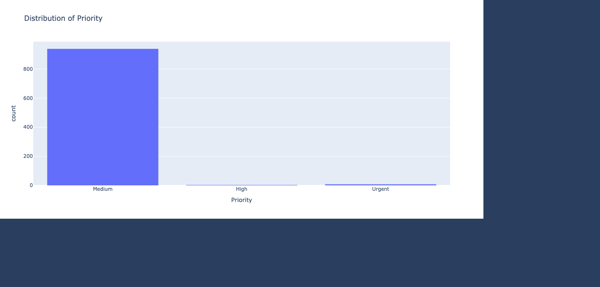
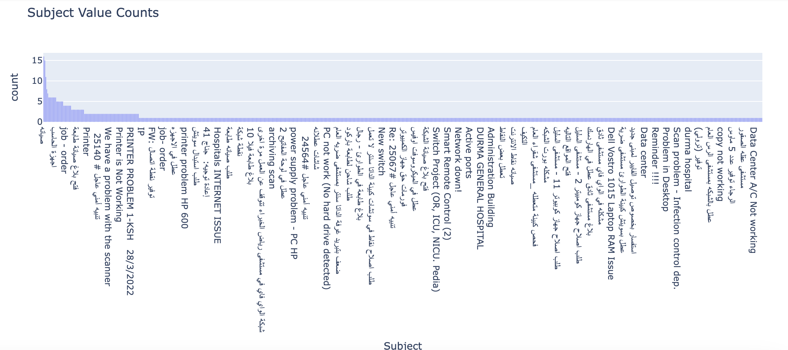
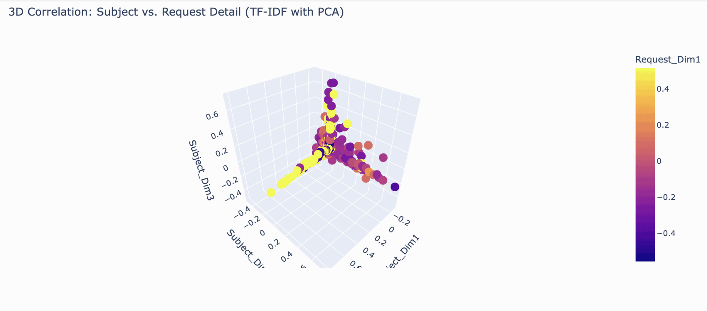
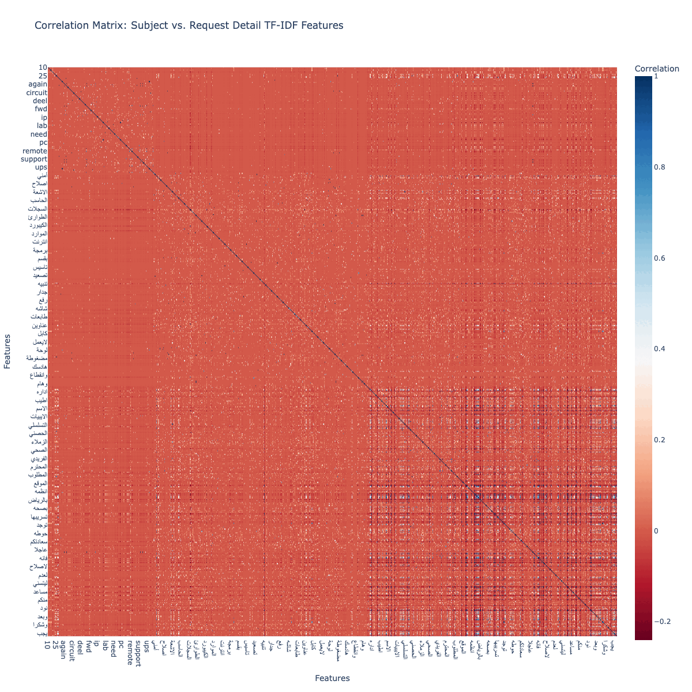
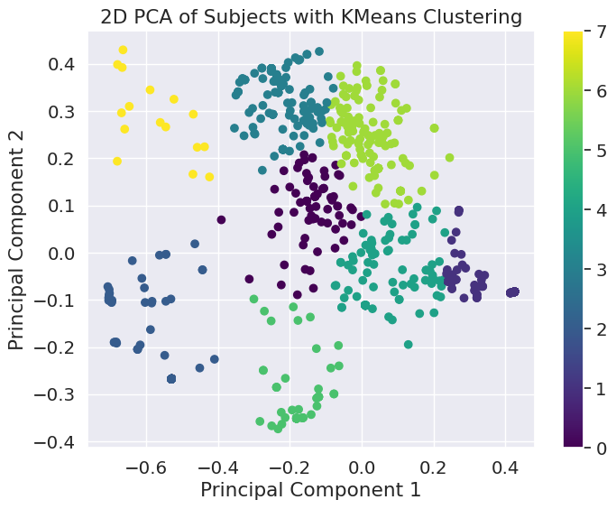
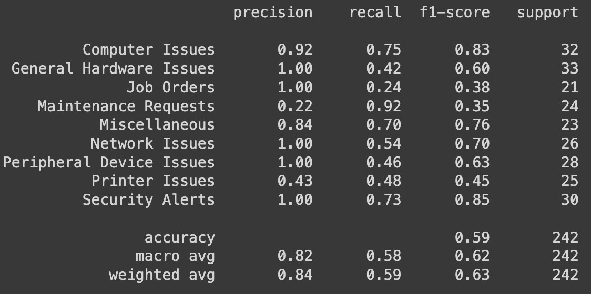
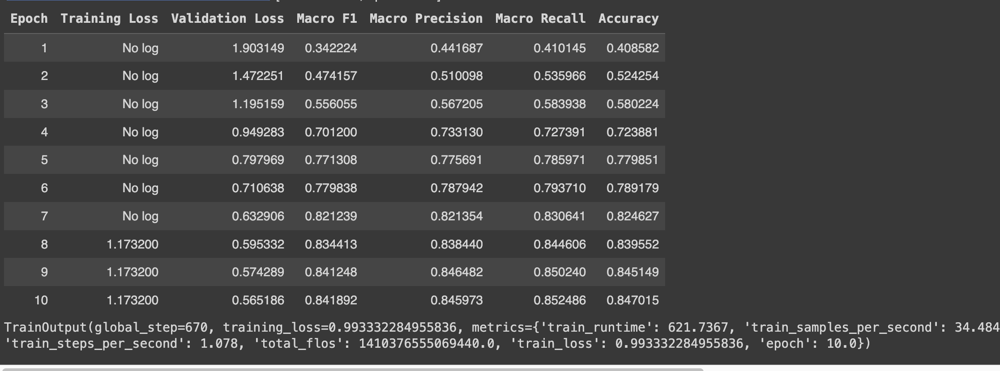

- [](https://colab.research.google.com/drive/1ZRzwdN7C--i8vFADslYDwpkPwQVLUGXb?usp=sharing) - **AraBert-Mini-Medium**

- [](https://colab.research.google.com/drive/1POiN7j0JmJDYupA-Vppr_qg_hNhEZ5A3?usp=sharing) - **CAMeL-Poetry-Arabic**

- [](https://colab.research.google.com/drive/1DO8EyR_zanXakP_T6Llrv8h68oLOpxiB?usp=sharing) - **Llama-3.2-1B**


- [](https://colab.research.google.com/drive/1nkK_ZCKYhPDdxn6WWgnhM8MBIG4D1iNo?usp=sharing) - **Llama-3.1-8B-Instruct**


--------------------------------

This repository contains a project focused on building a machine learning classifier for text data. The dataset, provided in the form of an email attachment, includes records with no predefined labels. The goal of the project is to identify and assign meaningful labels based on the content of the "Request Detail" ,  "Notes" fields, "Subject", fields, "Subject_Eng" fields and "Request Type" fields which are predominantly in Arabic, though English may also be present.

--------------------------------
### The primary objectives of this project are:

### 1. Data Processing

#### Techniques Applied:
- **Drop Columns:** Remove `Unnamed: 0` and other unneeded columns.
- **Text Preprocessing:**  
  - Apply **stemming** and **lemmatization**.
  - **Remove null** and **duplicate values**.
  - Perform **Arabic normalization**.
  - Remove **special characters** and **punctuation**.
  - Apply **regular expressions** to clean Arabic letters.
  - Remove **numbers** (Arabic and English).
  - **Split hashtags** into separate words.
  - Remove **Arabic stop words**.
  - **Clean hashtags**.
  - Remove **English stop words** (optional).
  - Remove **emojis** (optional).
  - **Remove whitespace**.
  - Remove **URLs**, **HTML tags**, **emails**, **phone numbers**, and **fax numbers**.
  - (Optional) Remove **tweets**.
  - Remove **Arabic diacritics**.
  - (Optional) Remove **outliers**.
  - (Optional) Apply **translation** if the majority of the cleaned values are empty or just whitespace.

#### Before Cleaning:
- **Original Text:**
  ```text
  *** This is an external email. Be Vigilant and take precautions.***
  نفيد سعادتكم بوجود مشكله في جهاز عيادة العظام_x000D_حيث انه لا يمكن الدخول وفتح الجهاز بيوزر موظف وزاره الصحة_x000D__x000D_نوع الجهاز : DEEL OPTIPLEX 3080_x000D_رقم الجهاز : DLH0PJ3_x000D__x000D_برجاء الاطلاع وتوجيه المختصين ليدكم لحل المشكلة...
  ```

#### After Cleaning:
- **Cleaned Text:**
  ```text
  نفيد سعادتكم بوجود مشكله في جهاز عياده العظام حيث انه لا يمكن الدخول وفتح الجهاز بيوزر موظف وزاره الصحه نوع الجهاز رقم الجهاز برجاء الاطلاع وتوجيه المختصين ليدكم لحل المشكله ولكم جزيل الشكر مدير تقنيه المعلومات بمستشفي السليل العام منصور بن عبدالله الحابي...
  ```


--------------------------------


## 2. Exploratory Data Analysis (EDA)
---------------------------------



--------------------------------


* Word Cloud Mapping for the combine text of Request Details and Notes... and apply some outer stop words from a corpus in arabic



* The charts show that the majority of issues arise from computers and printers. It’s essential to classify these as distinct categories. Prioritizing these will improve issue resolution. 
The bar chart displays the frequency of different subjects in the dataset. 
The x-axis represents the unique subjects and the y-axis indicates the number of occurrences of each subject.
The subject with the highest frequency is '{fig.data[0].x[0]}' with a count of {fig.data[0].y[0]}. 
Other subjects with notable counts include '{fig.data[0].x[1]}', '{fig.data[0].x[2]}', and so on.

 

* Distribution of the word count 




* Apply PCA to reduce the dimensionality of the data and show the cardinalty of the data

 

* Box Plot for Average Character per Word declared by Staus



* Correlation of Words between Subject And Request Detail, and there is a lack of correlation between Subject and Notes

* The Correlation between Notes and Sbuject Details is pretty good to concatenate  together to give a hight correlation for the input text 


----------------------------------

### 3. Data Labeling

* **Labeling with Fuzzy Matching (FuzzWuzz):**  
  I applied fuzzy string matching using FuzzWuzz, which calculates the differences between sequences based on Levenshtein Distance. This helped me identify the most frequent words in the 'Notes' and 'Request Details' sections. From this process, I categorized the data into 10 distinct classes.

* **Zero-shot Classification with XLM-Roberta-large-XNLI:**  
  Using the XLM-Roberta-large-XNLI model, I performed zero-shot classification. Based on my understanding of the data, I initially proposed 6 candidate classes, which were then refined into final categories.

* **Labeling with KMeans and PCA:**  
  I employed TF-IDF with 100 features, followed by Principal Component Analysis (PCA) with 2 components, and KMeans clustering. This approach resulted in 8 clusters, which were further labeled into 8 classes.

  

* **Determining Optimal Clusters with the Elbow Method:**  
  To find the optimal number of clusters, I applied the elbow method, running KMeans across a range of 2 to 20 clusters. The best number of clusters was determined by identifying where the inertia (within-cluster variance) ceased to significantly decrease. Based on this, I selected 5 clusters, leading to 5 final classes.

  

* **Zero-shot and Few-shot Classification with T5:**  
  For further classification, I utilized the T5 model in a zero-shot and few-shot setting, selecting around 5 to 6 candidate classes. You can review the implementation details in the accompanying code.


Here’s a more readable and structured version of your section on Text Classification:

--------------------------------

### 4. Text Classification

#### 5 Classes

1. **Model Name:** `asafaya/bert-mini-arabic`  
   - **Training Data:** A combination of translated notes and request details.
   - **Classes:** 
     - Hardware Issue
     - Network Problem
     - Software Problem
     - Power Supply Issue
     - Peripheral Issue

   

2. **Model Name:** `CAMeL-Lab/bert-base-arabic-camelbert-ca-poetry`  
   - **Training Data:** Same as above (translated notes and request details).
   - **Method:** Applied PCA with KMeans clustering, testing cluster ranges from 2 to 20 to find the optimal number of clusters. The best result was achieved with KMeans set to 5 clusters.
   - **Classes:** 
     - Hardware Issue
     - Network Problem
     - Software Problem
     - Power Supply Issue
     - Peripheral Issue

   

* **K-Fold Training Results:**  
   The training was conducted using K-Fold cross-validation, yielding the following results:

   

#### 10 Classes

3. **Model Name:** `asafaya/bert-mini-arabic` (Medium)  
   - **Training Data:** Only request details were used as the main sentences for training.
   - **Method:** Applied FuzzyWuzz for class assignment, resulting in 10 classes. The data was balanced accordingly.
   - **Classes:**
     - Printer Issues
     - Uncategorized
     - Miscellaneous
     - Computer Issues
     - Network Issues
     - Maintenance Requests
     - General Hardware Issues
     - Peripheral Device Issues
     - Security Alerts
     - Job Orders

     
   

4. **Model Name:** `CAMeL-Lab/bert-base-arabic-camelbert-ca-poetry`  
   - **Training Data:** Only request details were used as the main sentences for training.
   - **Method:** Used FuzzyWuzz to generate and balance 10 classes.
   - **Classes:** Same as model 3.

   

5. **Model Name:** `Llama 3.2-instruct 1b`  
   - **Training Data:** Only request details were used as the main sentences.
   - **Method:** Used FuzzyWuzz for class creation, and selected the top 10 classes. The data was balanced accordingly.
   - **Classes:** Same as model 3.

     
     
   

6. **Model Name:** `Llama 3.1 7b`  
   - **Training Data:** Only request details were used as the main sentences.
   - **Method:** Similar to previous models, used FuzzyWuzz to assign 10 classes and balanced the data accordingly.
   - **Classes:** Same as model 3.

     
   

---


----------------------------------
### 6. Evaluation

**For 5 Classes:**

Input Text (translated):  
*We inform you of an issue with the orthopedic clinic device. The device cannot be accessed using the employee’s credentials. Please review and direct the appropriate personnel to resolve the issue. Thank you, Mansour Abdullah Al-Habi, IT Manager, Al-Salil General Hospital. This notice includes sensitive information, legally protected. Unauthorized disclosure, use, or duplication of this message is strictly prohibited.*

**Results:**  
| Label               | Confidence Score  |
|---------------------|-------------------|
| Power Supply Issue  | **0.956**          |
| Software Problem    | 0.016              |
| Hardware Issue      | 0.013              |
| Network Problem     | 0.009              |
| Peripheral Issue    | 0.006              |

---

**For 10 Classes:**

Input Text (translated):  
*We inform you of an issue with the orthopedic clinic device. The device cannot be accessed using the employee’s credentials. Please review and direct the appropriate personnel to resolve the issue. Thank you, Mansour Abdullah Al-Habi, IT Manager, Al-Salil General Hospital. This notice includes sensitive information, legally protected. Unauthorized disclosure, use, or duplication of this message is strictly prohibited.*

**Results:**  
| Label                    | Confidence Score  |
|--------------------------|-------------------|
| Maintenance Requests      | **0.552**          |
| Computer Issues           | 0.141              |
| Miscellaneous             | 0.110              |
| Uncategorized             | 0.058              |
| Printer Issues            | 0.055              |
| Security Alerts           | 0.019              |
| General Hardware Issues   | 0.040              |
| Network Issues            | 0.015              |
| Job Orders                | 0.006              |
| Peripheral Device Issues  | 0.005              |

---


### 6. Conclusion
In this evaluation, I employed a lightweight model that demonstrated strong performance and is well-suited for deployment in a machine-based ticket support system. While more advanced models like GPT, LLaMA, or GEMMA variants (with over 7 billion parameters) offer higher capacity, they also come with significant computational overhead. For a task of this nature, which primarily involves text classification, such heavy models are not necessary.

The BERT-based models used in this pipeline achieved satisfactory accuracy and evaluation metrics, making them an ideal balance between performance and resource efficiency. Therefore, deploying these lightweight BERT variants provides a practical and cost-effective solution without sacrificing accuracy or reliability in the classification task

### 7. Project Structure
```
  - data/: Contains the dataset (pre-labeled and raw).
  - notebooks/: Jupyter notebooks detailing the exploratory data analysis (EDA) and model development process.
  - src/: Source code for data preprocessing, model training, and evaluation scripts.
  - results/: Contains evaluation reports and visualizations of the model's performance.
  - README.md: Detailed instructions on how to run the project and interpret the results.
```

### 8. Installation and Usage

1. **Clone the Repository**:
    ```bash
    git clone https://github.com/username/repo-name.git
    cd repo-name
    ```

2. **Install Dependencies**:
    ```bash
    pip install -r requirements.txt
    ```


### License

This project is licensed under the MIT License.
