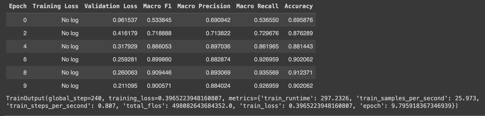
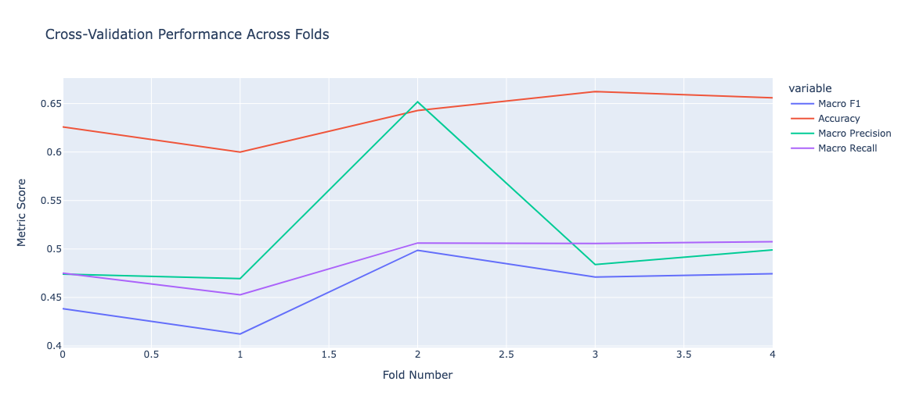
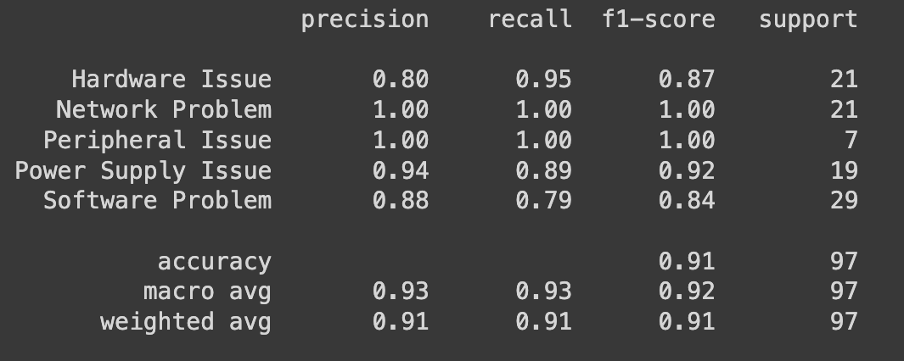

# Ticketing_system_Task
[](https://colab.research.google.com/drive/1ZRzwdN7C--i8vFADslYDwpkPwQVLUGXb?usp=sharing)

--------------------------------
## Text-Based LLM Classifier for Unlabeled Data
This repository contains a project focused on building a machine learning classifier for text data. The dataset, provided in the form of an email attachment, includes records with no predefined labels. The goal of the project is to identify and assign meaningful labels based on the content of the "Request Detail" ,  "Notes" fields, "Subject", fields, "Subject_Eng" fields and "Request Type" fields which are predominantly in Arabic, though English may also be present.
--------------------------------
### The primary objectives of this project are:

<summary><b>1. Data Processing</b></summary>

  Techniques:
  - Drop Unnamed: 0 column and Uneeded columns  - Apply Stemming and Lemmatization
  - Remove Null values - Remove Duplicate values - Apply Arabic normalization - Remove Special Characters
  - Remove Punctuations - Apply Regular Expression Techniques with Arabic Letters
  - Remove Numbers - Apply splitting hashtag to words - Remove Arabic Stop Words - Clean hashtag
  - Remove English Stop Words - (Optional) Remove emoji - Remove Whitespace - Remove URLs
  - Remove HTML Tags - Remove Emails - Remove Phone Numbers - Remove Fax Numbers 
  - (Optional) Remove Tweets - Remove Arabic Numbers - Remove Arabic Diacritics - (Optional) Remove Outliers
  - (Optional) Apply Translation if Columns after cleaning most Values ' ' or empty values 


  Before Cleaning:
    df_process["Request Detail"][0]

  ```
  *** This is an external email. Be Vigilant and take precautions.***_x000D_*** Do not click links or open attachments or reply unless you recognize the sender and their email address,
   and you are expecting the email.***_x000D__x000D__x000D_نفيد سعادتكم بوجود مشكله في جهاز عيادة العظام_x000D_حيث انه لا يمكن الدخول وفتح الجهاز بيوزر موظف وزاره الصحة_x000D__x000D_نوع الجهاز : DEEL OPTIPLEX 3080_x000D_رقم الجهاز : DLH0PJ3_x000D__x000D_برجاء الاطلاع وتوجيه المختصين ليدكم لحل المشكلة_x000D__x000D_ولكم جزيل الشكر 
   ،،،،_x000D__x000D__x000D__x000D_مدير تقنية المعلومات بمستشفى السليل العام_x000D_منصور بن عبدالله الحابي_x000D_0556355578_x000D__x000D__x000D_[MANSOUR ABDULLAH AL-HABI (2)]_x000D__x000D__x000D__x000D__x000D__x000D_تنبيه بإخلاء المسئولية: هذه الرسالة ومرفقاتها معدة لاستخدام المُرسَل إليه المقصود بالرسالة فقط و قد تحتوي على معلومات سرية أو محمية قانونيا. إن لم تكن الشخص المقصود، فإنه يُمنع منعا باتا أي عرض أو نشر أو استخدام غير مصرح به للمحتوى. نرجو إخطار المُرسِل عن طريق الرد على هذا
    البريد الإلكتروني وإتلاف جميع النسخ الموجودة لديك. تعد التصريحات و الآراء المذكورة في الرسالة خاصة بالمُرسِل و لا تمثل وزارة الصحة. كما لا تتحمل الوزارة مسؤولية الأضرار الناتجة عن أي فيروسات قد تحملها هذه
     الرسالة._x000D__x000D_CONFIDENTIALITY NOTICE: This e-mail message, including any attachments, is for the sole use of the intended recipient(s) and may contain confidential and privileged information or otherwise protected by law. If you are not the intended recipient, you are notified that any unauthorized review, use, disclosure or distribution is strictly prohibited. please notify the sender by replying to this email and destroy all copies of the original message. Statements and opinions expressed in this Email are those of the sender, and do not necessarily reflect 
    those of Ministry of Health (MOH). Ministry of Health (MOH) accepts no liability for damage caused by any virus transmitted by this Email._x000D__x000D__x000D_MOH Site. <http://www.moh.gov.sa>_x000D_[attachment name=image001.jpg]
  ```

  After Cleaning:
  df_process["Request Detail"][0]
  ```
   نفيد سعادتكم بوجود مشكله في جهاز عياده العظام حيث انه لا يمكن الدخول وفتح الجهاز بيوزر موظف وزاره الصحه نوع الجهاز رقم الجهاز برجاء الاطلاع وتوجيه المختصين ليدكم لحل المشكله ولكم جزيل الشكر مدير تقنيه المعلومات بمستشفي السليل العام منصور بن عبدالله
    الحابي تنبيه باخلاء المسءوليه هذه الرساله ومرفقاتها معده لاستخدام المرسل اليه المقصود
     بالرساله فقط و قد تحتوي علي معلومات سريه او محميه قانونيا ان لم تكن الشخص المقصود فانه يمنع منعا باتا اي عرض او نشر او استخدام غير مصرح به للمحتوي نرجو اخطار المرسل عن طريق الرد علي هذا البريد الالكتروني واتلاف جميع النسخ الموجوده لديك تعد التصريحات و الاراء
    المذكوره في الرساله خاصه بالمرسل و لا تمثل وزاره الصحه كما لا تتحمل الوزاره مسءوليه الاضرار الناتجه عن اي فيروسات قد تحملها هذه الرساله 
  ```

<details>
  <summary><b>2. Exploratory Data Analysis (EDA)</b></summary>
  Perform EDA to understand the distribution of the data, the presence of missing values, and the need for data cleaning. Use visualizations and statistical techniques to uncover patterns and insights from the dataset.
</details>

<details>
  <summary><b>3. Dimensionality Reduction</b></summary>
  Apply dimensionality reduction techniques such as Principal Component Analysis (PCA) or t-SNE to visualize the data in a lower-dimensional space. This helps in understanding the inherent structure of the data and identifying clusters or outliers.
</details>

<details>
  <summary><b>4. Feature Engineering</b></summary>
  Explore various natural language processing (NLP) techniques to extract and preprocess features from the text data in both Arabic and English. Techniques may include tokenization, stop-word removal, word embeddings.
</details>

<details>
  <summary><b>5. Data Labeling</b></summary>
  Implement a strategy to generate labels from the text data. The labels should reflect key discrepancies or noteworthy information derived from the "Request Detail" and "Notes" fields. Utilize techniques such as fuzzy matching, keyword extraction, Zero-shot classification, Few-shot classification and manual annotation where necessary.
</details>


## 6. Text Classification with Model Evolution
    Models:

----------------------------------------------------------------------------------------------------------

    1.model_name ="CAMeL-Lab/bert-base-arabic-camelbert-ca-poetry"
    Trained Text is A Combination fo Notes After transalte the needed infotmation from it , and Request Details
    Mapping for these Part of Classes using PCA for it wiht kmeans and give a range from 2:20 to get the best 
    and get the best intria_ at kmean=5
    Classes: label_list_HARD = ['Hardware Issue', 'Network Problem', 'Software Problem', 'Power Supply Issue', 'Peripheral Issue']


    pipe("نفيد سعادتكم بوجود مشكله جهاز عياده العظام الدخول وفتح الجهاز بيوزر موظف نوع الجهاز رقم الجهاز برجاء الاطلاع وتوجيه المختصين ليدكم لحل المشكله ولكم جزيل الشكر مدير تقنيه المعلومات بمستشفي السليل العام منصور عبدالله الحابي تنبيه باخلاء المسءوليه ومرفقاتها معده لاستخدام اليه بالرساله فقط تحتوي سريه محميه قانونيا تكن الشخص فانه يمنع منعا باتا عرض نشر استخدام مصرح للمحتوي اخطار الالكتروني واتلاف النسخ الموجوده لديك تعد التصريحات الاراء بالمرسل تمثل تتحمل مسءوليه الاضرار الناتجه فيروسات تحملها")
    Results: 
    [[{'label': 'Hardware Issue', 'score': 0.013072000816464424},
    {'label': 'Network Problem', 'score': 0.009265456348657608},
    {'label': 'Software Problem', 'score': 0.01583610288798809},
    {'label': 'Power Supply Issue', 'score': 0.9559705257415771},
    {'label': 'Peripheral Issue', 'score': 0.005855914205312729}]]
    
Add K-fold Training Steps:



----------------------------------------------------------------------------------------------------------

    2.model_name="asafaya/bert-mini-arabic"
    Trained Text is A Combination fo Notes After transalte the needed infotmation from it , and Request Details
    Classes: label_list_HARD = ['Hardware Issue', 'Network Problem', 'Software Problem', 'Power Supply Issue', 'Peripheral Issue']


----------------------------------------------------------------------------------------------------------
    3.model_name="asafaya/bert-mini-arabic" -> Meduim
    Just Use the Request Details as my main sentences 
    Use FuzzyWuzz Methods for making the classes and choose the nest part of it when number of classes = 9 in addition I balance the classes
    Classes: label_list_HARD = [Printer Issues, Uncategorized, Miscellaneous, Computer Issues , Network Issues , Maintenance Requests , General Hardware Issues , Peripheral Device Issues , Security Alerts , Job Orders]

----------------------------------------------------------------------------------------------------------
    3.model_name="asafaya/bert-mini-arabic" -> MEDUIM
    Use the 


<details>
  <summary><b>7. Model Evaluation</b></summary>
  Assess the performance of the model using standard evaluation metrics such as accuracy, F1-score, precision, and recall. Compare the predictions against a validation set of manually labeled data to measure the effectiveness of the model.
</details>


### Project Structure

- `data/`: Contains the dataset (pre-labeled and raw).
- `notebooks/`: Jupyter notebooks detailing the exploratory data analysis (EDA) and model development process.
- `src/`: Source code for data preprocessing, model training, and evaluation scripts.
- `results/`: Contains evaluation reports and visualizations of the model's performance.
- `README.md`: Detailed instructions on how to run the project and interpret the results.

### Getting Started

1. **Clone the Repository**:
    ```bash
    git clone https://github.com/username/repo-name.git
    cd repo-name
    ```

2. **Install Dependencies**:
    ```bash
    pip install -r requirements.txt
    ```

### Contributing

Contributions are welcome! Feel free to submit issues or pull requests if you have ideas for improvement or new features.

### License

This project is licensed under the MIT License.

---

This description should provide a clear and professional overview of the project, its goals, structure, and usage.